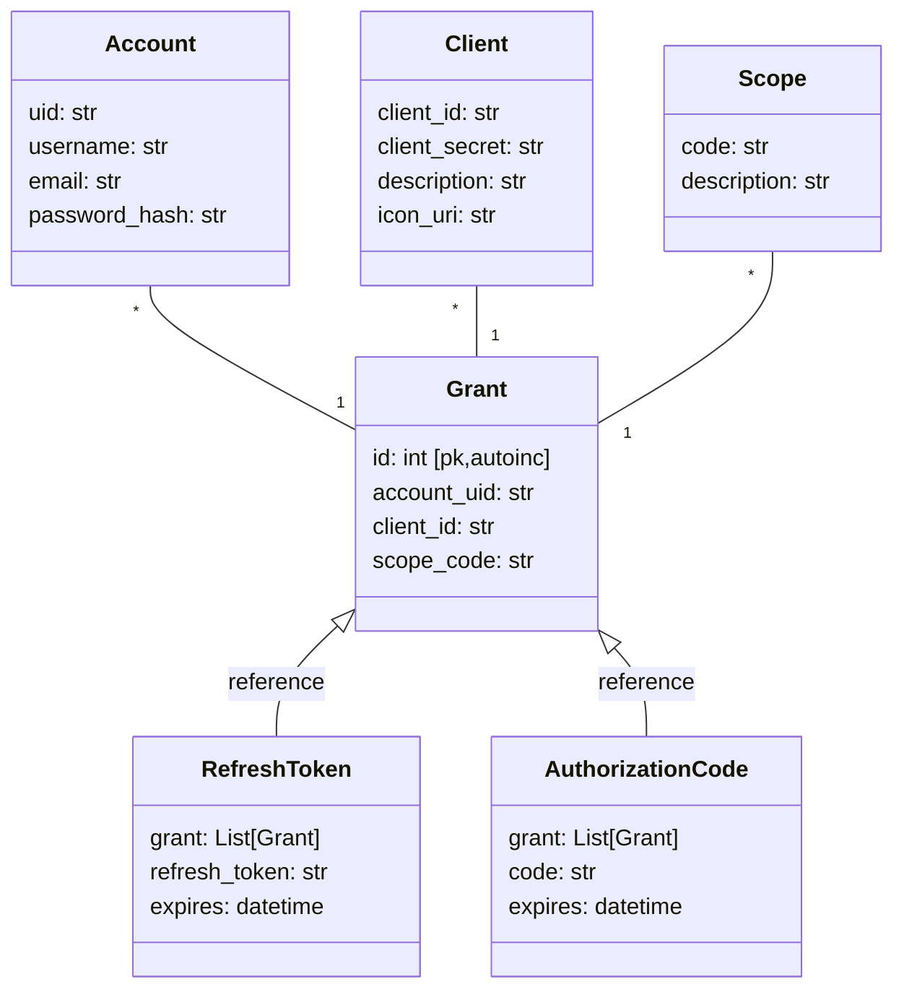

## Authorizations

An association table `GrantedScope` contains the list of scope granted by an account to an oauth2 client application. On subsequent authorizations, authorize screen may be skipped if required scopes have already been granted by this account, to this client.



We are going to define 2 functions in order to manage `ApplicationGrant` table; whose role is to remember scopes that an account previsouly granted to an application.

```python

def get_granted_scopes(account_uid: str, client_id: str) -> List[str]:
    """
    Find all scopes that have previously been granted by an account to an app.
    """
    grants = Grant.query.filter(
        Grant.account_uid == account_uid,
        Grant.client_id == client_id
    )
    return set([grant.scope_code for grant in grant])


def set_granted_scopes(account_uid: str, client_id: str, scopes: List[str]):
    """
    Grant scopes that enable an application to access an account.
    Only add missing scopes in database.
    """
    grants = []
    for scope in get_granted_scopes(account_uid, client_id):
        Grant.create(
            account_uid=account_uid,
            client_id=client_id,
            scope_code=scope
        )
```

Once this is done, it will be usefull in various cases. 

For example, to make `/authorize` view redirect without displaying consent screen where it is not needed. Developers can call `/authorize` view as follow
```
/authorize?...&scope=...&force_consent_display=true
```

Where `force_consent_display` is a boolean passed by client application, that determines whether consent screen should be displayed even if user already granted required scopes to this specific application.
